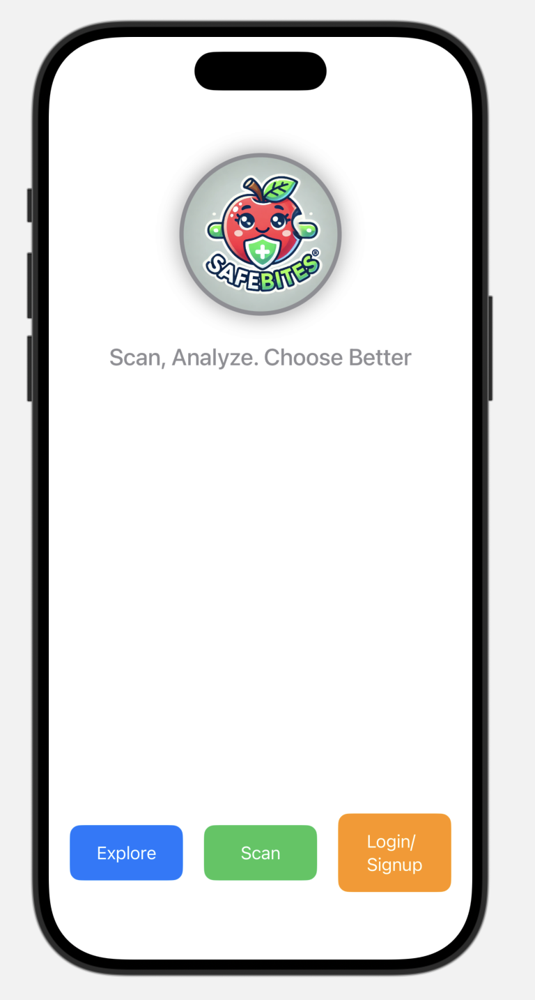
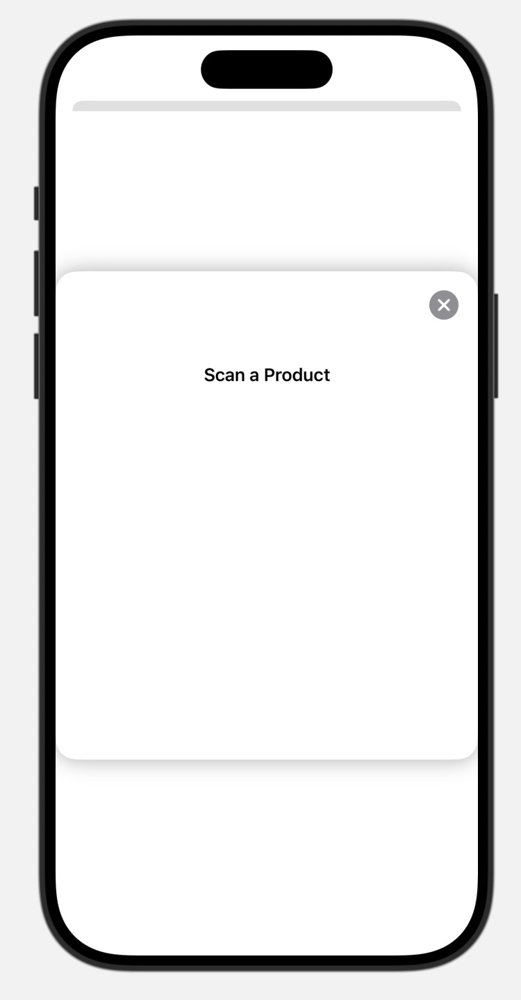
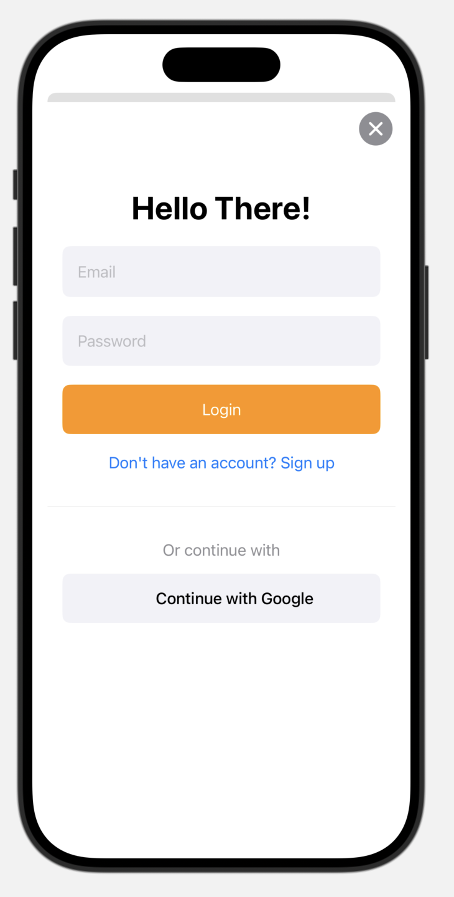

# BiteSafely

**BiteSafely** is an iOS app designed to help users scan barcodes, analyze product information, and make informed choices. The app features a clean and intuitive user interface, making it easy for users to scan barcodes and view relevant details.

---

## Features

- **Barcode Scanning**: Scan barcodes using the device's camera.
- **User-Friendly Interface**: Simple and intuitive design for seamless navigation.
- **Customizable Buttons**: Explore, scan, and login/signup options for enhanced user experience.
- **Real-Time Feedback**: Display scanned barcode information instantly.

---

## Screenshots

| Home Screen | Scanner Screen | Login/Signup Screen |
|-------------|----------------|----------------|
|  |  |  |

---

## Technologies Used

- **SwiftUI**: For building the user interface.
- **AVFoundation**: For barcode scanning functionality.
- **Xcode**: For development and testing.

---

## Requirements

- iOS 15.0+
- Xcode 13.0+
- Swift 5.5+

---

## Installation

### 1. Clone the Repository
```bash
git clone https://github.com/your-username/BiteSafely.git
cd BiteSafely
```
### 2. Open the Project in Xcode

Open BiteSafely.xcodeproj in Xcode.
### 3. Build and Run

Select a simulator or connect a physical device.
Click the Run button (or press Cmd + R) to build and run the app.
## Usage
---
1. Launch the App:
Open the app on your iOS device or simulator.
2. Scan a Barcode:
Tap the Scan button to open the barcode scanner.
Point the camera at a barcode to scan it.
3. View Scanned Code:
The scanned barcode will be displayed on the home screen.
4. Explore or Login:
Use the Explore and Login/Signup buttons to navigate through the app.
---

## License

This project is licensed under the MIT License. See the LICENSE file for details.

## Acknowledgments

Apple Documentation: For guidance on SwiftUI and AVFoundation.
Stack Overflow: For troubleshooting and community support.

## Contact

For questions or feedback, feel free to reach out:

Niral Nadisara
Email: niral1995.nn@gmail.com
GitHub: @niralsara
Enjoy using BiteSafely! 🚀
